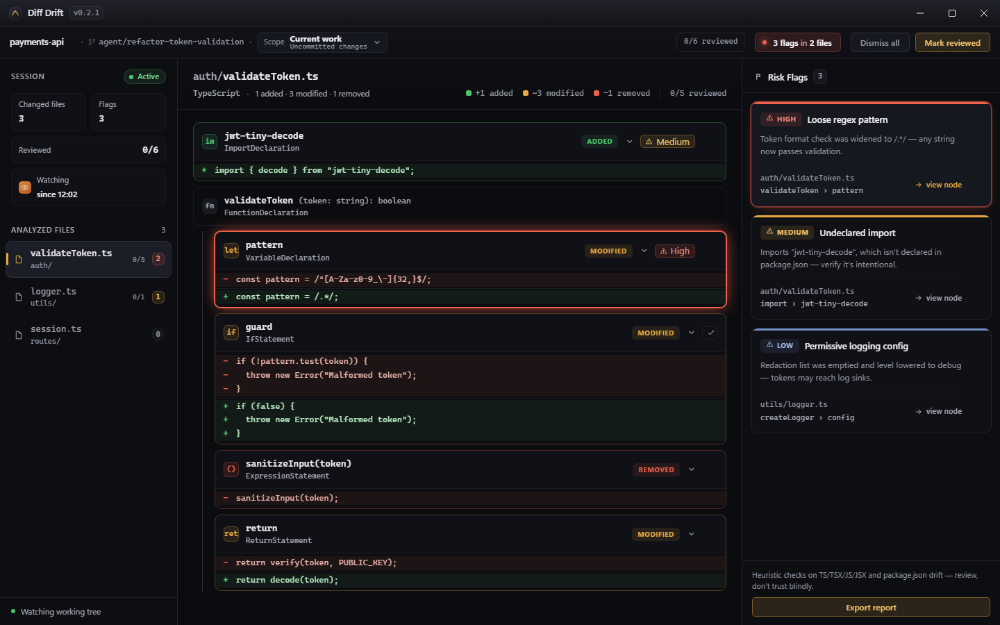

# Diff Drift

<p align="center">
  
</p>

<p align="center">
  <strong>AST-level security review for the code drift left by AI coding agents.</strong>
</p>

<p align="center">
  <a href="LICENSE"></a>
  
  
  
  
  
</p>

<p align="center">
  <a href="#quick-start">Quick start</a> ·
  <a href="docs/wiki/Development.md">Development</a> ·
  <a href="docs/wiki/Architecture.md">Architecture</a> ·
  <a href="LICENSE">License</a>
</p>

<p align="center">
  
</p>

Diff Drift is a local desktop reviewer for TypeScript, TSX, JavaScript, and JSX drift — plus package.json dependency drift.

It is built for developers using AI coding agents who want a deterministic second pass over what the agent changed before they trust it.

Use it when an agent made a broad edit, a refactor touched security-sensitive code, or a normal diff is too noisy to explain what structurally changed.

- Shows structural AST drift against a baseline you choose: `HEAD`, the **trust point** pinned by your last review (drift stays visible after the agent commits), the merge-base with `main`, or any rev.
- Flags heuristic security concerns such as loosened validation, removed sanitization, disabled TLS checks, undeclared imports, and dependencies the lockfile can't vouch for.
- Lets you review changes node by node with progress tracking, dismiss flags, mark the drift reviewed, and export a Markdown or JSON report.
- Doubles as a read-only gate for scripts and agents: `diff-drift check --json` exits with the highest active severity.

Diff Drift runs locally and is deliberately not an LLM. It does not send repository contents to a server or model API — it's the reviewer in the loop that can't hallucinate or be prompt-injected.

## Quick Start

Prerequisites: Node.js 18+, Rust stable, Microsoft C++ Build Tools, and WebView2.

```bash
npm install
npm run tauri dev
```

For fast browser-only UI work:

```bash
npm run dev
```

## Status

- Supported platform: Windows 11.
- macOS: experimental and unsigned. Signing and notarization are not configured.
- Current version: `0.2.0`.
- License: [MIT](LICENSE).

## Docs

- [User Guide](docs/wiki/User-Guide.md)
- [Concepts](docs/wiki/Concepts.md)
- [Rule Reference](docs/wiki/Rule-Reference.md)
- [Architecture](docs/wiki/Architecture.md)
- [Development](docs/wiki/Development.md)
- [Release and Platform Support](docs/wiki/Release-and-Platform-Support.md)
- [Troubleshooting](docs/wiki/Troubleshooting.md)
- [Questions and ideas](https://github.com/Statusnone420/Diff-Drift/discussions)

The `docs/wiki/` pages are the source copy for the GitHub wiki.
