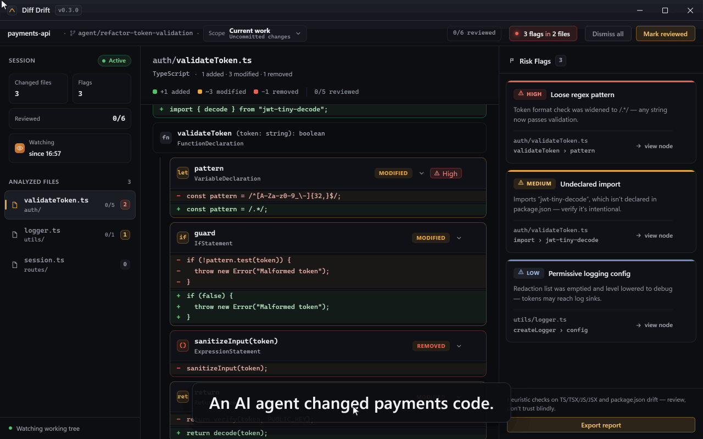
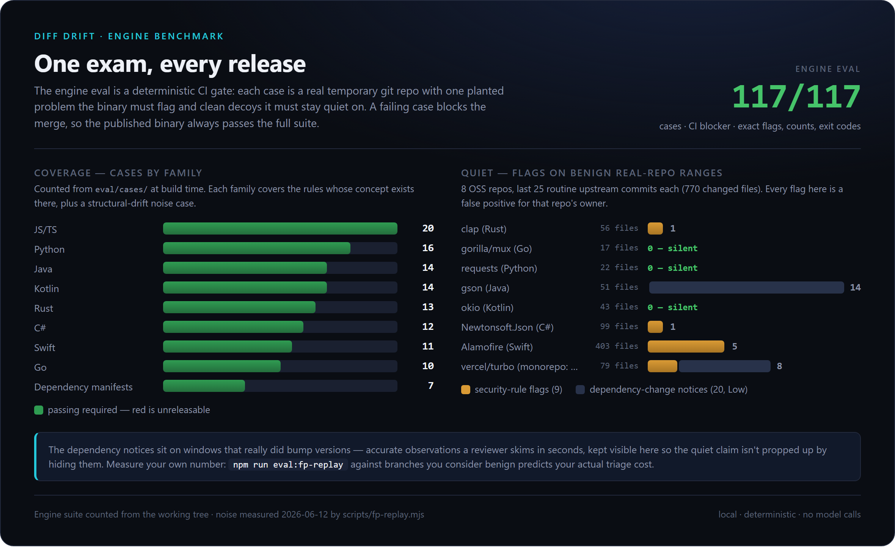
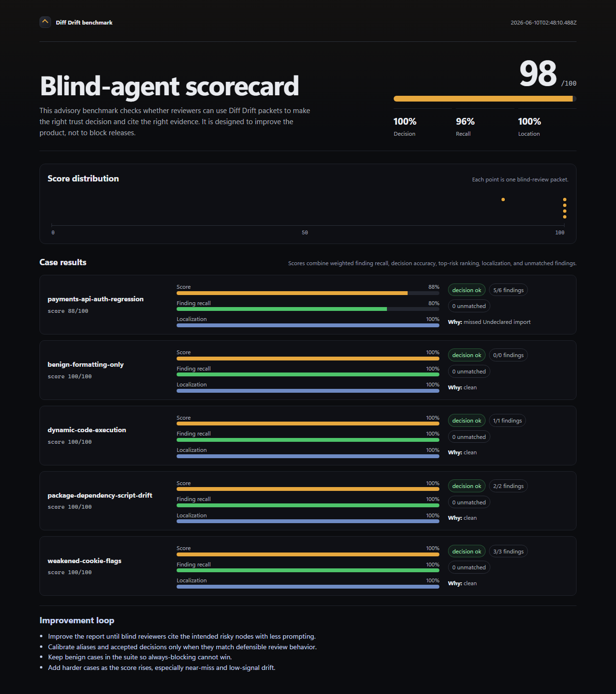

# Diff Drift

<p align="center">
  
</p>

<p align="center">
  <strong>Review what an AI coding agent changed since the last state you trusted.</strong>
</p>

<p align="center">
  <a href="LICENSE"></a>
  
  
  
  
</p>

<p align="center">
  <a href="#try-it">Try it</a> ·
  <a href="#give-feedback">Give feedback</a> ·
  <a href="docs/wiki/Home.md">Wiki</a> ·
  <a href="CHANGELOG.md">Changelog</a> ·
  <a href="LICENSE">License</a>
</p>

<p align="center">
  
</p>

An AI agent just changed your repo. A normal diff shows you every hunk it touched. What you actually need to know is what structurally changed since the last point you trusted, and which of those changes still needs a human.

Diff Drift is that second pass. It compares your working tree against a baseline you pick — `HEAD`, the **trust point** pinned by your last review, or the merge-base with `main` — and shows the drift as changed AST nodes for TypeScript, TSX, JavaScript, JSX, Rust, Go, Python, Java, C#, Kotlin, and Swift, plus dependency drift for `package.json` and the Cargo, Go, PyPI, Maven, and NuGet manifests. You review node by node, dismiss flags that don't matter in your codebase, and mark the drift reviewed. That pins a trust point: when the agent commits and keeps working, the next session reopens only what changed again.

Flags point you at security-shaped drift — a loosened validation regex, removed sanitization, disabled TLS checks, undeclared imports, dependencies the lockfile can't vouch for. The flags run across the same languages, firing in each one where the language's idioms make them reliable; the differential before-vs-after rules are the cross-language core, and some flags stay scoped to the families where the concept exists. Most rules match structurally against the parsed AST rather than by text, so a pattern inside a string or comment doesn't trigger a flag and reformatting doesn't evade one. Some are differential: they compare a node against your trusted baseline and flag what got *weaker* — a regex that lost its anchors, a call that lost its guard — which a snapshot scanner can't see. An exported Markdown or JSON report gives you evidence for the PR, and the same engine runs headless with severity exit codes for CI and agent hooks.

## Try it

**Desktop:** download the Windows installer from [Releases](https://github.com/Statusnone420/Diff-Drift/releases) and check it against `SHA256SUMS.txt`. Releases are currently unsigned, so SmartScreen will warn on first run — details and reproducible builds in [Release and Platform Support](docs/wiki/Release-and-Platform-Support.md).

**CLI:** `diff-drift-cli.exe` runs the same check headless — installed next to the app, or downloaded bare from [Releases](https://github.com/Statusnone420/Diff-Drift/releases) (verify against `SHA256SUMS.txt`). It is a console binary, so every shell — PowerShell included — sees its exit code. Add it to `PATH`, then:

```bash
diff-drift-cli check . --baseline merge-base --md > diff-drift-report.md
```

The exit code is the highest active severity (`0` none, `1` low, `2` medium, `3` high, `64` usage error), so it drops straight into CI or a pre-commit hook. Copy-paste recipes: [CI and hook recipes](docs/wiki/User-Guide.md#ci-and-hook-recipes).

**GitHub Action:** gate a PR on drift without compiling anything (Windows runner; `fetch-depth: 0` so the merge-base resolves):

```yaml
- uses: actions/checkout@v4
  with: { fetch-depth: 0 }
- uses: Statusnone420/Diff-Drift@v0.5.1
  with: { baseline: merge-base, fail-on: medium }
```

**From source:** [Node.js](https://nodejs.org/) 20.19+/22.12+, [Rust](https://rustup.rs/) stable, [C++ Build Tools](https://visualstudio.microsoft.com/visual-cpp-build-tools/), then `npm install && npm run tauri dev`. Browser-only UI work: `npm run dev`.

## What it is not

- It runs locally and uses no AI itself. No model calls, no telemetry, no repository upload — verify that instead of trusting it: [Privacy and Data Flow](docs/wiki/Privacy-and-Data-Flow.md).
- It is not a full SAST engine, and a clean run is not proof that code is safe. Flags are heuristic prompts for a reviewer, not verdicts. Need deep dataflow analysis? Run Semgrep or CodeQL alongside.
- It does not replace human review. It points review at the risky nodes first.

| Tool | Its job | Diff Drift's lane |
| --- | --- | --- |
| `git diff` | Exact text changes | Structure instead of hunks, plus triage state and exit codes |
| PR review | Judgment | Points reviewers at the risky nodes first — never replaces them |
| Semgrep | Broad rule-based SAST | Drift-scoped, zero-config, local; tracks review across agent commits |
| CodeQL | Deep dataflow analysis | Answers a different question: "what did the agent just change?" |

## Give feedback

This is a public feedback release ([release notes](docs/releases/v0.3.0-public-feedback.md)). The question that decides where this project goes:

> Would you use this before trusting code changed by an AI coding agent? Why or why not?

Answer it in [**I tried Diff Drift**](https://github.com/Statusnone420/Diff-Drift/issues/new?template=tried-diff-drift.yml) — or report an [install problem](https://github.com/Statusnone420/Diff-Drift/issues/new?template=install-problem.yml), a [noisy flag](https://github.com/Statusnone420/Diff-Drift/issues/new?template=noisy-flag.yml), or [confusing output](https://github.com/Statusnone420/Diff-Drift/issues/new?template=confusing-output.yml). Not sure it's an issue? [Start a discussion](https://github.com/Statusnone420/Diff-Drift/discussions). Be as blunt as you like.

## Evaluation

A deterministic engine benchmark gates CI: 117 fixture cases through the real binary with exact expected flags and exit codes (`npm run eval:engine`). The coverage card below is computed from the suite and the latest real-repo noise run — case counts per family on the left, active flags on benign upstream ranges of 8 OSS repos on the right.

<p align="center">
  
</p>

The blind-agent panel is advisory, model-only, and based on a small synthetic suite — treat any headline number accordingly. Each model plays a blind reviewer over benchmark v4 packets and scores how reliably it reaches the right trust decision from Diff Drift's output. The current panel lands **91–99 / 100** across three models (Claude Opus 4.8 and Sonnet 4.6 at 99, Haiku 4.5 at 91); independent external validation pending. Details, version history, and the rubric are in [BENCHMARKING.md](BENCHMARKING.md) and [Eval Methodology](docs/wiki/Eval-Methodology.md).

<p align="center">
  
</p>

To predict your own triage burden, run `npm run eval:fp-replay` on your repos; that's the number that matters for you.

## Status

- Supported platform: Windows 11. macOS: experimental and unsigned.
- Current version: `0.5.1` ([changelog](CHANGELOG.md)). License: [MIT](LICENSE). Security policy: [SECURITY.md](SECURITY.md).

## Docs

- [User Guide](docs/wiki/User-Guide.md) · [Concepts](docs/wiki/Concepts.md) · [Rule Reference](docs/wiki/Rule-Reference.md) · [FAQ](docs/wiki/FAQ.md)
- [Threat Model](docs/wiki/Threat-Model.md) · [Privacy and Data Flow](docs/wiki/Privacy-and-Data-Flow.md)
- [Benchmarking](BENCHMARKING.md) · [Eval Methodology](docs/wiki/Eval-Methodology.md) · [A/B Study Design](docs/wiki/AB-Study-Design.md)
- [Architecture](docs/wiki/Architecture.md) · [Development](docs/wiki/Development.md) · [Release and Platform Support](docs/wiki/Release-and-Platform-Support.md) · [Troubleshooting](docs/wiki/Troubleshooting.md)
- [Demo script](docs/demo/demo-script.md) · [Feedback triage](docs/feedback/feedback-triage.md)

The `docs/wiki/` pages are the source copy for the GitHub wiki.
